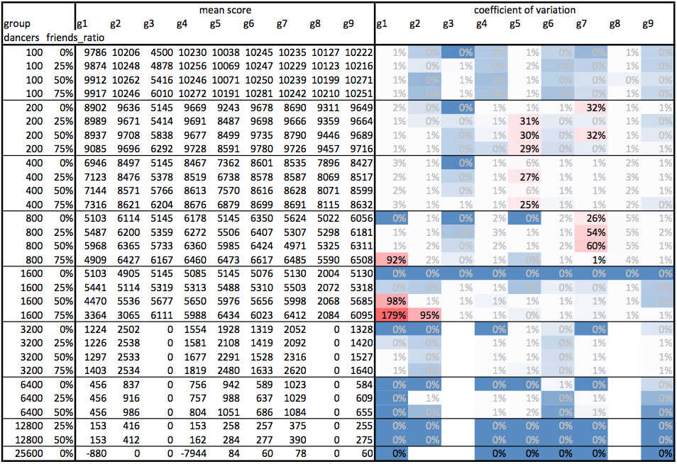
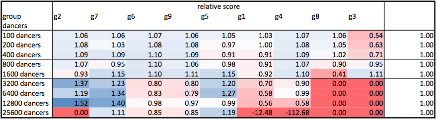
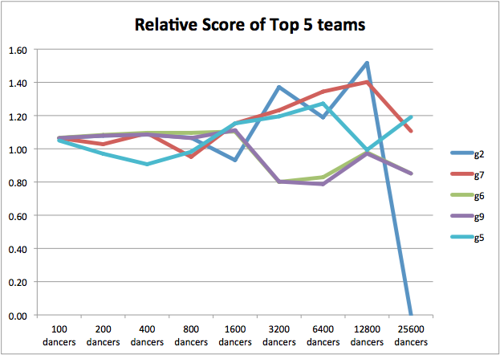

# Tournament Analysis

## Mean Scores and Coefficient of Variation

## Big Variations for g2

* variation is generally pretty low ( < 1% )
* For g2, huge variation of 95% for (1600, 75%)

|    |  dancers|  friends| group|  score|
|----|--------:|--------:|:----:|------:|
|1791|     1600|     1200|    g2|   6024|
|1792|     1600|     1200|    g2|    141|
|1793|     1600|     1200|    g2|   5925|
|1794|     1600|     1200|    g2|    141|
|1795|     1600|     1200|    g2|    141|
|1796|     1600|     1200|    g2|   5967|
|1797|     1600|     1200|    g2|    141|
|1798|     1600|     1200|    g2|    141|
|1799|     1600|     1200|    g2|   6017|
|1800|     1600|     1200|    g2|   6016|

## Big Variations for g2

* because of estimating friend density for our Medium Strategy
* dance with partners for longer duration
* competitive score of 5989.80 in half the scenarios
* meagre 141 for the rest
* 50% chance that the unluckiest dancer will not find friends
* Because of the uncertainty, better off just ignoring friends
* should try to ensure that every dancer dances

## Big Variations for g1 and g7

* also see a huge variation because of claustrophobia.
* Other high variations are due to single outliers (on the worse side) in data.

|    |  dancers|  friends| group|  score|
|----|--------:|--------:|:----:|------:|
|1360|      800|      200|    g7|  -3230|
|1437|      800|      400|    g7|  -2776|
|1468|      800|      600|    g1|  -8686|
|1702|     1600|      800|    g1|  -8688|
|1781|     1600|     1200|    g1|  -8687|
|1782|     1600|     1200|    g1|  -8686|
|2388|    25600|        0|    g1|   -880|
|2391|    25600|        0|    g4|  -7944|

## Tournament categories

* Small
    - for $d<=800$
    - It is possible to systematically find soulmates
* Medium
    - for $800 < d <=1600$
    - It is possible for all dancers to dance at the same time on the dance floor
* Large
    - for $1600 < d$
    - We require some sort of scheduling to ensure each of the dancer gets to dance
    - none of the dancers should suffer claustrophobia

## Team wise Scores

* each row is a heat map, blue being better score
* **Our group (g2) scores the best Average**, closely followed by g7
* Next best score is by g6 and g9, which share a rather noticable correlation!

## Team categories

* g1 and g7
    - score well on all categories
    - thus score highest and second higher respectively
* g6, g9, g4
    - score well on small category
* g5
    - scores well on Large category
    - but fails to perform on Small

## Relative Performance

## Relative Performance

## Relative Performance

* strength is relatively stronger scores in Large category
* to order, we follow a simple average, which seems to favor Small category
* Yet we achieve the highest overall average
* testimony to our performance across categories

## Performance in Large category
* For Large category, our strategy has step behavior
* g7 seems to have a more continuous looking behavior
<!-- * Present the values of number of dancers vs maximum dancers without creating claustrophobia -->

| friends | batch size | num batches | target score | num dancing cols |
|--------:|-----------:|------------:|-------------:|-----------------:|
|    3200 |        1680|            2|          2545|                42|
|    6400 |        1520|            5|          1002|                38|
|    12800|        1280|           10|           439|                32|
|    25600|         720|           36|           105|                18|

* claustrophobia to mitigate: -50 = 16 turns
* target score: 105 = 35 turns
* 50 turns for dancing per batch
* 10 turns for moving per batch
* 1800 / 60 = 30 batches can be handled
