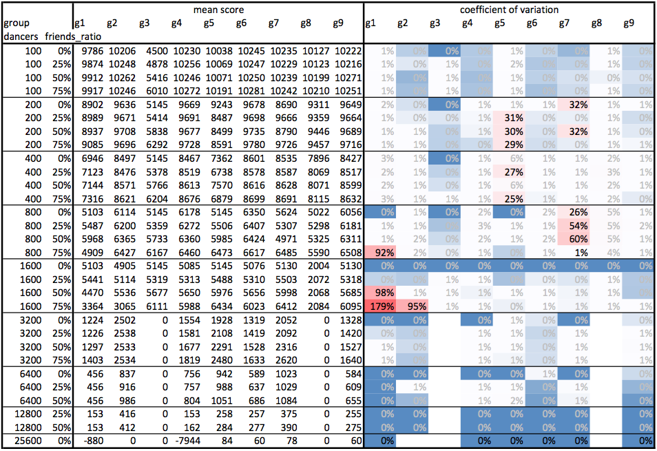
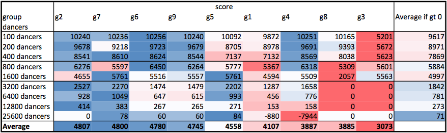
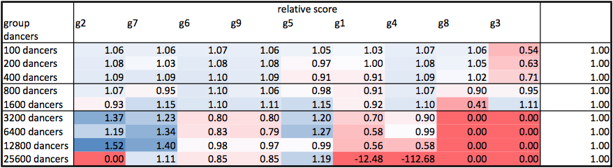
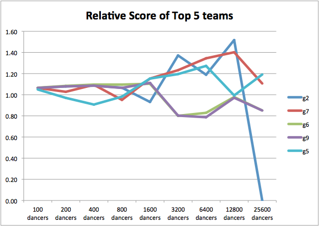

# Tournament Analysis

## Mean Scores and Coefficient of Variation

The tournament is run by considering different number of dancers and friends.
Mean scores and coefficient of variation (standard deviation / mean)  of for
various teams is shown in figure \ref{img-mean-cov}.



We note that the variation for configurations is generally pretty low ( $< 1\%$ ).
For our group, g2, we notice a huge variation of 95% for 1600 dancers and 75% friend density.
On further investigating we notice the following distribution for the given bucket:

```
df1[(df1.dancers == 1600)&(df1.friends == 1200)&(df1.group == 'g2')]
```

|    |  dancers|  friends| group|  score|
|----|--------:|--------:|:----:|------:|
|1791|     1600|     1200|    g2|   6024|
|1792|     1600|     1200|    g2|    141|
|1793|     1600|     1200|    g2|   5925|
|1794|     1600|     1200|    g2|    141|
|1795|     1600|     1200|    g2|    141|
|1796|     1600|     1200|    g2|   5967|
|1797|     1600|     1200|    g2|    141|
|1798|     1600|     1200|    g2|    141|
|1799|     1600|     1200|    g2|   6017|
|1800|     1600|     1200|    g2|   6016|

We try to estimate the friend density for our Medium Strategy and based on it,
we dance with partners for longer duration of time if we think we have more friends.
This gamble does not seem to pay off. We get a competitive score of 5989.80 in half the scenarios
and a meagre 141 for the rest.
We can interpret the result it to state that there is still a 50% chance that the worst case
dancer will not be able to find friends and dance with them.
Because of the uncertainity involved, we would have been better off just ignoring friends and
trying to ensure that every dancer dances.

We also notice that other players like g1 and g7 also see a huge variation because of claustrophobia.
Other high variations are due to single outliers (on the worse side) in data.

```
df1[df1.score < 0]
```

|    |  dancers|  friends| group|  score|
|----|--------:|--------:|:----:|------:|
|1360|      800|      200|    g7|  -3230|
|1437|      800|      400|    g7|  -2776|
|1468|      800|      600|    g1|  -8686|
|1702|     1600|      800|    g1|  -8688|
|1781|     1600|     1200|    g1|  -8687|
|1782|     1600|     1200|    g1|  -8686|
|2388|    25600|        0|    g1|   -880|
|2391|    25600|        0|    g4|  -7944|

## Team wise Scores
After noting that generally the variations are low and that scores increasing with ratio of friends
as a general trend, we decide to take an average across number of friends to evaluate the performance
of each team.
We also categorize the tournament in three categories:

* Small
    - for $d<=800$
    - It is possible to systematically find soulmates
* Medium
    - for $800 < d <=1600$
    - It is possible for all dancers to dance at the same time on the dance floor
* Large
    - for $1600 < d$
    - We require some sort of scheduling to ensure each of the dancer gets to dance
    - none of the dancers should suffer claustrophobia




Figure \ref{team-scores} shows the results for each of the configuration.
We color each row with a heat map, blue being better score.
**Our group (g2) scores the best Average**, closely followed by g7.
Next best score is by g6 and g9, which share a rather noticable correlation!
We notice the following kinds of teams:

* g1 and g7
    - score well on all categories
    - thus score highest and second higher respectively
* g6, g9, g4
    - score well on small category
* g5
    - scores well on Large category
    - but fails to perform on Small

We normalize the scores based on an average of positive scores in each category in \ref{team-rel}
and plot a curve to see the development of scores with number of dancers for the top 5 teams as shown in figure \ref{team-5-rel}.





As you may notice, the strength of our group is the relatively stronger scores in Large category.
But to decide an ordering, we still follow a simple average, which seems to favor Small category.
Even so, we achieve the highest overall average, which is testimony to our performance across categories.

For Large category, our strategy has step behavior. Where as g7 has a more continuous looking behavior.
We present the values of number of dancers vs maximum dancers without creating claustrophobia.
